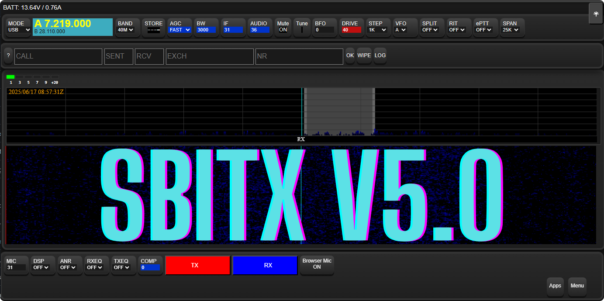

# zBitx - 32-Bit Version



An improved version of the zBitx application designed for the zBitx hardware. This version is designed for the 32-bit Raspberry Pi image, which will be availabled at [here](https://github.com/drexjj/zbitx/releases) inthe future.

### Please note that CW is not fully working on this BETA build. We are trying to identify the root cause.


## 🚀 Core Development Team

We have an incredible development team collaborating on improvements for the sBitx platform:

- **JJ - W9JES**
- **Juan - WP3DN**

A huge thank you to everyone who contributes their time and expertise to this project!

## 📂 File Compatibility

The files here are designed to work on the modified, 32-bit version provided in the [Releases](https://github.com/drexjj/zbitx/releases) section.

You will also need the modified front panel display firmware (UF2 file) found at [https://github.com/drexjj/zbitxfrontpanel](https://github.com/drexjj/zbitxfrontpanel/releases)


## 🔴 Backup Your Data First!

Before installing this version, **backup your existing** `sbitx/data` **and** `sbitx/web` **folders** to a safe location. This ensures you don’t lose important data such as your logbook, hardware calibration, and user settings.

### Backup Methods


#### 2️⃣ Manual Backup

You can manually back up your data using the terminal:

```console
cd $HOME && mv sbitx sbitx_orig
```

To restore your backup after installation:

```console
cd $HOME && cp -r sbitx_orig/web/*.mc sbitx/web/ && cp -r sbitx_orig/data/* sbitx/data/
```

## 🔧 Installation & Upgrades

For detailed installation and upgrade instructions, please visit the [Wiki Page](https://github.com/drexjj/zbitx/wiki/) which will be created in the future.

```console
cd $HOME && git clone https://github.com/drexjj/zbitx && mv zbitx sbitx
```

## 📥 Download the 32-Bit Image

A preconfigured, downloadable Raspberry Pi Zero 2W image file will be available soon. This image is designed for a **32GB SD card or USB drive** and can be installed using **Balena Etcher** or **Raspberry Pi Imager**.

**Bonus**: The image comes preinstalled with other useful ham radio tools.

🔗 [**Download the latest version**](https://github.com/drexjj/zbitx/releases)

## 👏 Contributors & Credits

A huge thank you to the contributors who have played a vital role in this project! including Farhan, VU2ESE for creating the initial project.


## 🌟 Support the Project

If you find these enhancements valuable or have benefited from using sBitx, consider supporting our work. Every donation, big or small, helps us keep development going.

💖 [**Donate Here**](https://www.paypal.com/donate/?hosted_button_id=SWPB76LVNUHEY) 💖

Can't donate? No worries! Contributing code, documentation, or spreading the word also makes a big impact.

Thank you for your support and belief in this project!

